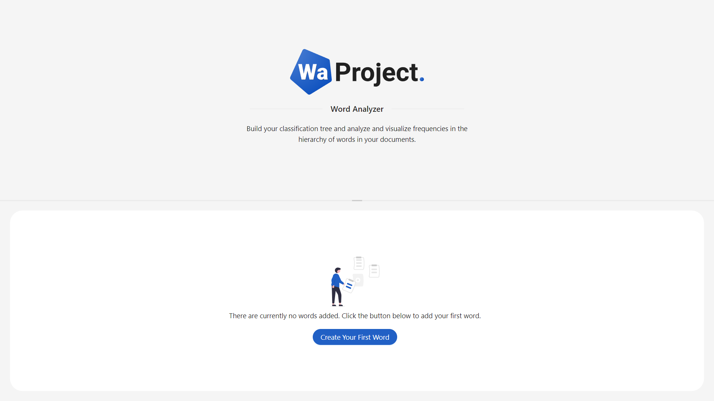
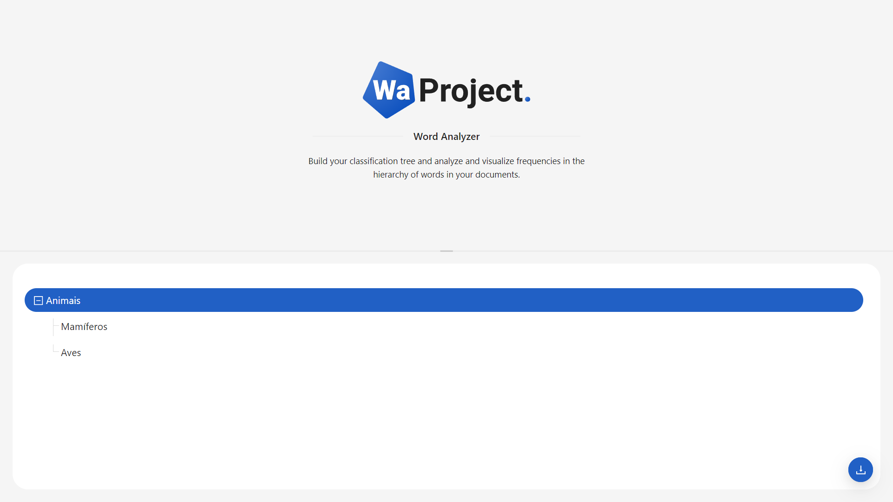

# Word Analyzer - Frontend

Esta é uma aplicação que permite construir e visualizar árvores de classificação de palavras de forma simplificada, permitindo salvar um arquivo JSON contendo uma hierarquia no formato correto para o processamento.

Este repositório contém a interface web construída com **[Vite](https://vitejs.dev/)** e **[React](https://react.dev/)**. O design da interface é baseado no **[Ant Design](https://ant.design/)**, e os testes foram implementados com a **[Testing Library](https://testing-library.com/)**.

## Índice
- [Uso](#uso)
- [Instalação](#instalação)
- [Estrutura do Projeto](#estrutura-do-projeto)
- [Testes](#testes)

## Uso

### Funcionalidades principais:
- **Visualização**: A árvore hierárquica é exibida de forma visual, permitindo uma navegação clara pelos níveis.
- **Adicionar Níveis**: A interface suporta a criação de níveis e subníveis de palavras de forma intuitiva.
- **Salvar Hierarquia**: O botão de salvar gera um arquivo JSON da estrutura criada e permite seu download.

### Funcionalidades adicionais

- **Estado vazio para a àrvore**: Exibe um estado vazio quando a árvore hierárquica não possui nenhuma palavra cadastrada.

### Interface

<p align="center">
    
    
</p>

A interface foi construída com **Ant Design**, proporcionando uma experiência de usuário fluida e moderna. Cada parte da hierarquia é exibida em componentes de fácil interação.

## Instalação

### Pré-requisitos:
- Node.js (v16+)
- npm ou yarn

### Passos:

1. Clone o repositório:
   ```bash
   git clone https://github.com/rodrigodebossans/wa-project-word-analyzer-fe.git
   cd wa-project-word-analyzer-fe
   ```

2. Instale as dependências:
   ```bash
   npm install
   # ou
   yarn install
   ```

3. Inicie o servidor de desenvolvimento:
   ```bash
   npm run start:dev
   # ou
   yarn start:dev
   ```

## Estrutura do projeto

A organização do projeto é simples e modular, facilitando a manutenção e a adição de novas funcionalidades.

```plaintext
src
├── components  # Componentes principais da aplicação
├── config      # Configurações da aplicação
├── global      # Estilos globais da aplicação
├── pages       # Páginas principais da aplicação
├── routes      # Rotas da aplicação
```

## Testes

Os testes unitários foram implementados utilizando a **React Testing Library** para garantir a funcionalidade correta da interface.

### Rodando os testes:

```bash
npm run test
# ou
yarn test
```